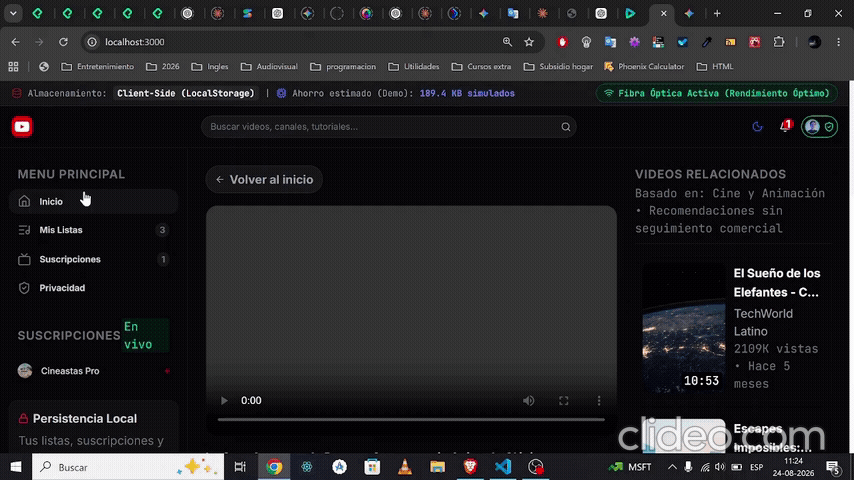
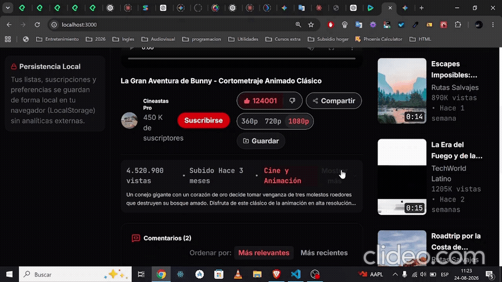
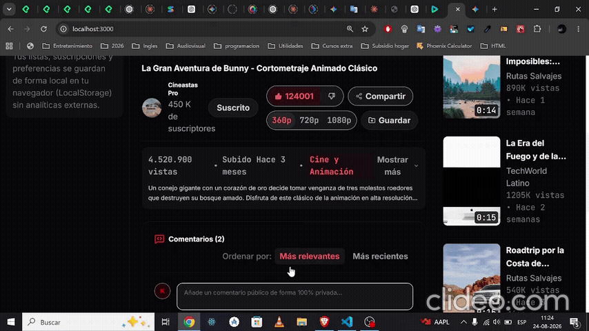
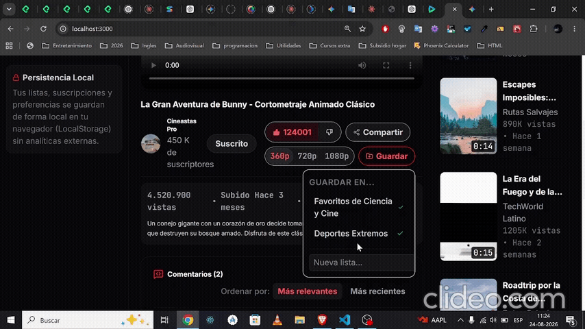

# YouTube Web — Moderna Video Platforma Frontend

Un cliente web frontend moderno, minimalista y de alto rendimiento inspirado en YouTube. Diseñado con una arquitectura modular basada en **React 19**, **TypeScript**, **Tailwind CSS v4** y **Motion**, priorizando la **privacidad por diseño (On-Device)**, la resiliencia en conexiones de red variables y la experiencia de usuario fluida.

---

## Pila Tecnológica

| Tecnología | Rol en el Proyecto |
| :--- | :--- |
| **React 19** | Biblioteca de UI y gestión de componentes |
| **TypeScript** | Tipado estricto e interfaces de datos |
| **Tailwind CSS v4** | Estilizado con motor de utilidades y modo oscuro |
| **Motion** | Animaciones de interfaz y microinteracciones |
| **Lucide React** | Iconografía SVG optimizada |
| **Vite 6** | Entorno de desarrollo y compilación |

---










---

## Inicio Rápido en Local

### Requisitos Previos

- **Node.js**: Versión 18.0.0 o superior (recomendado Node 20 LTS o superior).
- **npm** (v9+), **yarn** o **pnpm**.

### Pasos de Instalación

1. **Clonar o descargar el repositorio**

2. **Instalar dependencias**:
   ```bash
   npm install
   
3. ** Definiciones de tipos para React (Typescript))** 
   
   npm install -D @types/react @types/react-dom

4. **Iniciar proyecto**
   npm run dev

El proyecto se iniciará en http://localhost:3000